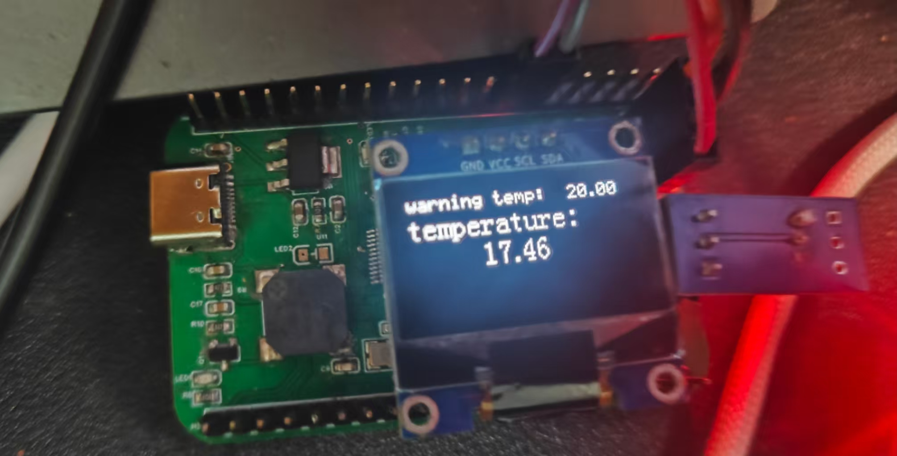
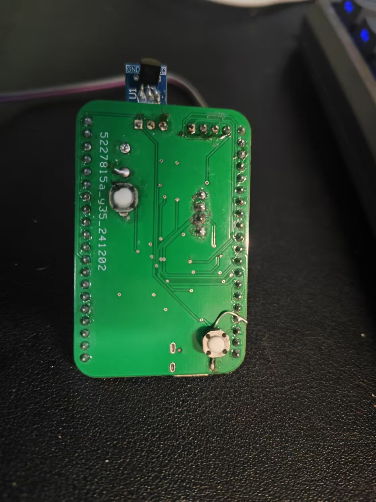

# 电子综合设计_readme

# DS18B20_TEMP_Detect

学校的课设，学习了滑动窗口滤波和时间均值滤波，想着用工程实现来体验一下，而不是MATLAB干仿真

时间均值滤波和滑动窗口滤波的参考网址：[滑动窗口滤波的C语言实现（简单易移植）_滑动滤波算法c语言实现-CSDN博客](https://blog.csdn.net/qq_37662088/article/details/125084985) 作者：月落三千雪

‍

使用了滑动窗口滤波来对测温进行平滑处理，使用无源蜂鸣器和LED进行温度报警，OLED进行温度显示，按键进行温度阈值调整

​​

​​

硬件上多飞了一个按键来进行阈值控制

‍

# 开发环境

* STM32CUBEIDE/KEILV5
* CUBEMX

# 文件目录

.  
|-- 00_Reference  `# 开源参考 感谢@0xabin 的 MultiTimer和 MultiButton`​  
|   |-- MultiButton-master  
|   |   -- MultiButton-master  
|   -- MultiTimer-main  
|       -- MultiTimer-main  
|-- 01_Function_Map `#功能路线图 有出入，还未实现菜单和存储功能，后续考虑加上`​  
|-- 02_Hardware
|   |-- 00_Ref  
|   |   |-- 00_HDK  
|   |   -- SCH_Schematic1_1_2024-12-28.pdf  `# 硬件原理图`​  
|   |-- 01_Project  
|   |   -- ProProject_STM32F1_TEMP_2024-12-15.epro `# 硬件工程，使用嘉立创打开`​  
|   -- BOM_Board1_1_Schematic1_1_2024-12-06.xlsx  `# BOM表`​  
|-- 03_Firmware  
|   |-- TEMP_SLIDING_WINDOW  `# 滑动窗口滤波的固件版本`​  
|   |\-- TEMP_averge  `# 时间均值滤波的固件版本`​  
|-- LICENSE  
-- README.md
